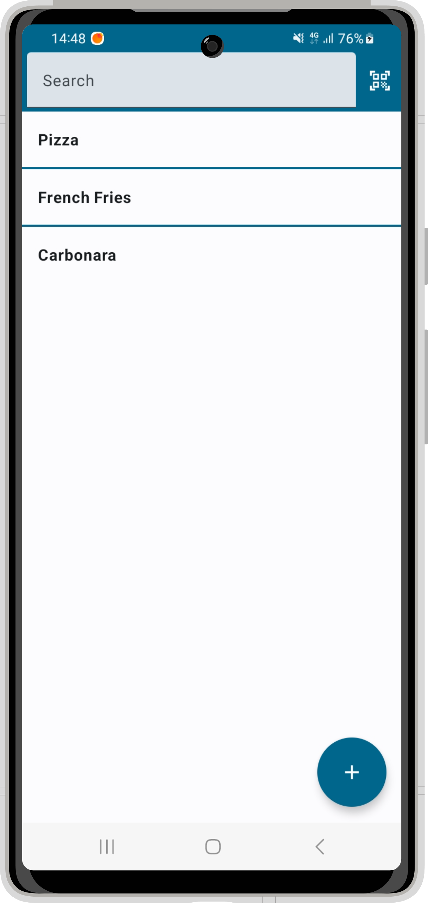
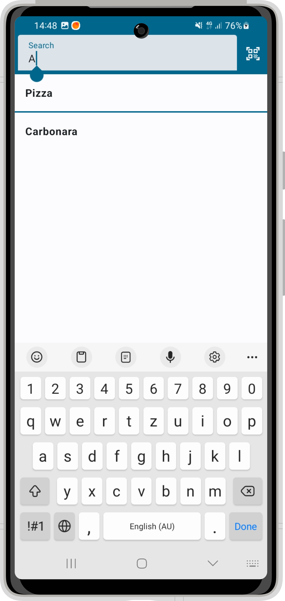
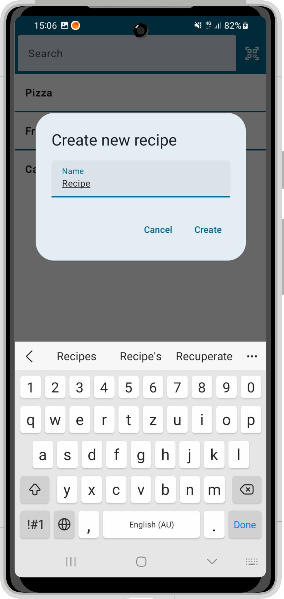
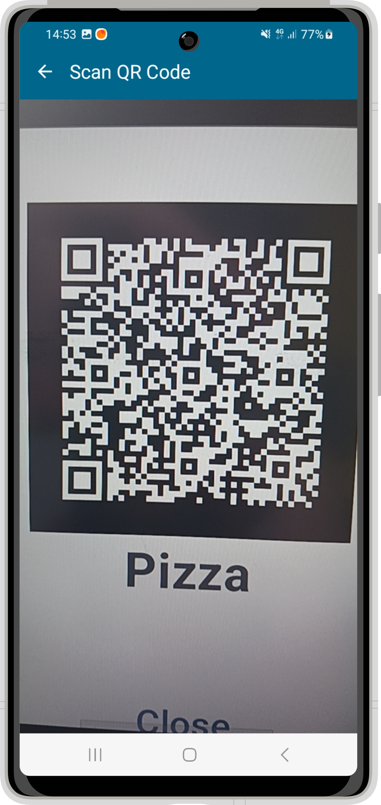
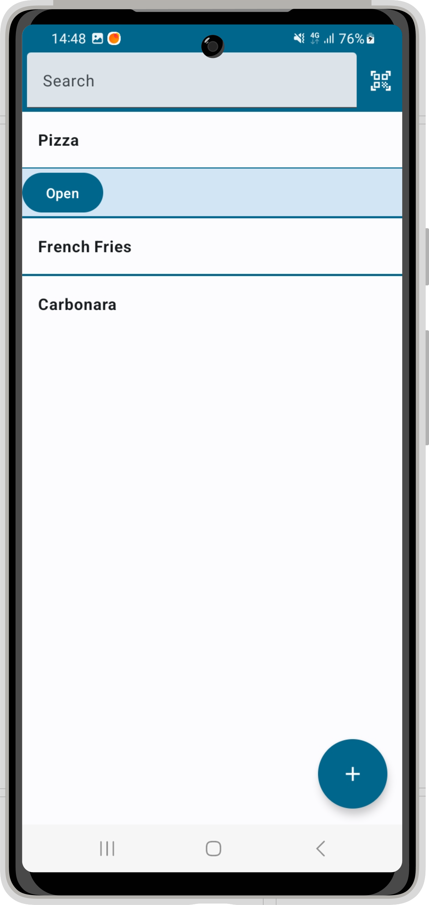
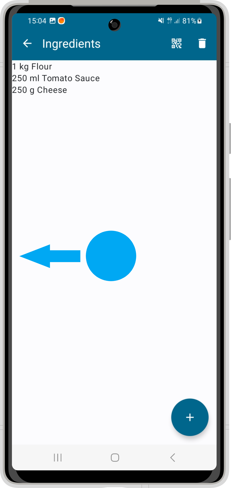
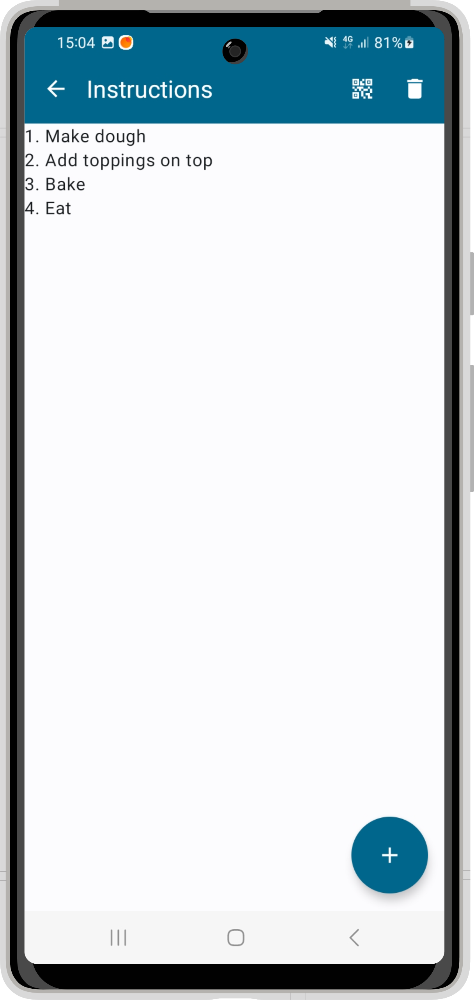
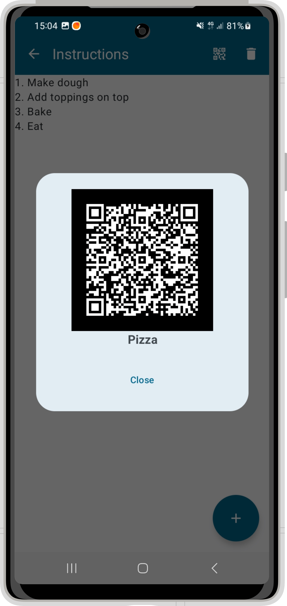
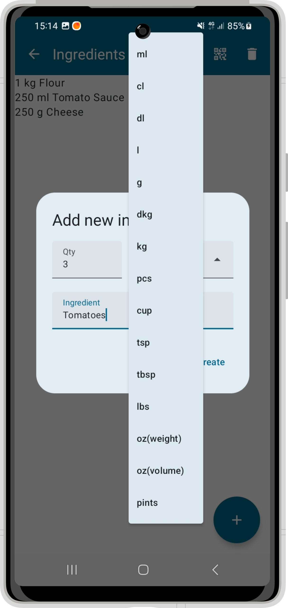
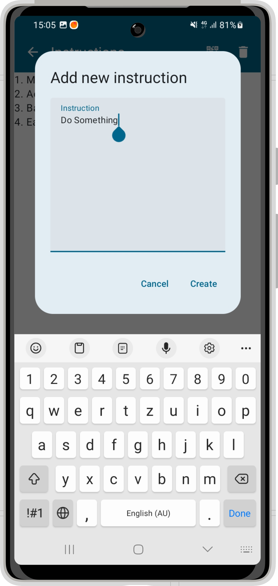

# Házi feladat specifikáció

Információk [itt](https://viauav21.github.io/laborok/hf)

## Androidalapú szoftverfejlesztés
### 2023.04.30
### Arató Bence Bálint - (H2TFTH)
### aratobenceb@gmail.com
### Laborvezető: Gazdi László

## Bemutatás

Az alkalmazás célja receptek tárolása későbbi felhasználásra. Segíti, hogy az emberek receptjei egy helyen 
legyenek tárolva, és ne kelljen mindig az adott receptet keresni, hiszen mind ott van a zsebükben.

## Főbb funkciók

Az alkalmazásban hozzá lehet adni új recepteket. A receptekhez tartoznak alapanyagok és instrukciók. Az
alkalmazás minden receptet azonnal eltárol, induláskor betölti azokat. Továbbá lehetővé teszi a receptek között
történő keresést azok neve alapján. Az alkalmazás bármely recepthez képes QR kódot generálni, azt egy másik telefonról
leolvasva képes a receptet elmenteni, így könnyítve meg receptek megosztását.

## Választott technológiák:

Az alkalmazás fejlesztése során használt technológiák tételes felsorolása. Az, hogy mi számít technológiának a laborokon ismertetésre kerül, a laborvezetőkkel tovább pontosítható.
5 technológia használata javasolt. Például:

- UI: A felhasználói felület Jetpack Compose-ban és MVVM architektúrával.
- Lista: A receptek, illetve azok adatai (hozzávalók, instrukciók) egy listában jelennek meg.
- Engedélykérés: Az alkalmazás engedélyt kér a kamera használatára, a kamerával olvassa be a QR kódokat.
- Adatbáziskezelés: Az alkalmáz a recepteket adataikkal együtt perzisztensen tárolja.
- Animáció

___

# Házi feladat dokumentáció

### RecipeBook

## Bemutatás

Az alkalmazás célja receptek tárolása későbbi felhasználásra. Segíti, hogy az emberek receptjei egy helyen
legyenek tárolva, és ne kelljen mindig az adott receptet keresni, hiszen mind ott van a zsebükben.

## Főbb funkciók

Az alkalmazásban hozzá lehet adni új recepteket. A receptekhez tartoznak alapanyagok és instrukciók. Az
alkalmazás minden receptet azonnal eltárol, induláskor betölti azokat. Továbbá lehetővé teszi a receptek között
történő keresést azok neve alapján. Az alkalmazás bármely recepthez képes QR kódot generálni, azt egy másik telefonról
leolvasva képes a receptet elmenteni, így könnyítve meg receptek megosztását.

## Felhasználói kézikönyv

Az alkalmazásba történő belépés után egy kezdő képernyő fogadja a felhasznót, amelyen megtalálható 
egy lista az elmentett receptekről. A képernyő tetején egy szövegdobozzal lehet a receptek között keresni.

1. ábra: A receptek listája a kezdőképernyőn és keresés a receptek között.

Új receptet a bal alsó sarokban található "+" feliratú gomb megnyomásával lehet hozzáadni. Ekkor egy dialógus ablak ugrik fel ahol a recept nevét kell megadni.

1. ábra: Receptet a recept nevének megadásával, majd a "Confirm" feliratú gomb megnyomásával lehet hozzáadni.

A kereső szövegdoboz mellett található gomb az alkalmazás QR kód olvasóját nyitja meg. A QR kód olvasó segítségével elmenthetünk recepteket amiket más felhasználók elmentettek a saját készülékükön.

2. ábra: Egy QR kód beolvasása az alkalmazás QR kód olvasójával.

Egy recept megérintésére lenyílik egy gomb amellyel a recept megnyitható. A gombra kattintva megtekinthetjük a recepthet mentett hozzávalókat, illetve utasításokat.

3. ábra: Az a recept az "Open" feliratú gombbal nyitható meg.

Egy recept megnyitása után a hozzávalók listája fogadja a felhasználót. A hozzávalók és az utasítások listája között könnyen lehet váltanu gesztúrákkal.

4. ábra: A listák között balra, illetve jobbra húzó mozdulattal lehet váltani.

A listák tetején három gomb található. Ezek sorban: visszalépés a kezdőképernyőre, a megnyitott recept megosztása QR kód segítségével, illetve a megnyitott recept törlése. A QR kód jelű gombra kattintva egy dialógus ablak jelenik meg melyben látható a recept QR kódja.

5. ábra: A megnyitott recept neve és QR kódja. A dialógus a "Close" feliratú gombbal zárható be.

Mindkét lista nézeten a "+" gombra kattinva adható hozzá a recepthet új adatot a felugró dialógus ablakban.

6. ábra: A dialógus ablakban a mezők kitöltésével, majd a "Confirm" felirató gomb megnyomásával adható új adat a recepthez. Új hozzávaló esetében a mértékegységet egy legördülő listából lehet kiválasztani.

## Felhasznált technológiák:

- **SQLite** alapú adattárolás
- A legördülő lista gombja **meg van animálva**
- Az almalmazás **engedélyt kér a kamera használatára** mielőtt a QR kód olvasót megnyitja
- Az alkalmás a **listakezelést lazy column segítségével** valósítja meg
- A **user interface Jetpack Compose-zal** készült
- A **QR kódok generálása** a [QRGenerator](https://github.com/androidmads/QRGenerator) és a [GSon](https://github.com/google/gson) könyvtárak használatával történik
- A **QR kódok olvasása** [CameraX](https://developer.android.com/jetpack/androidx/releases/camera) és [MLkit](https://developers.google.com/ml-kit/vision/barcode-scanning/android) segítségével történik

## Fontosabb technológiai megoldások

**A számodra legnehezebb/legérdekesebb funkciót fejtsd ki kb.  10 mondatban, hogy mi volt a probléma és hogyan oldottad meg.**

Az alkalmazás képes a receptekből QR kódot generálni, illetve ilyen QR kódot beolvasni és belőle a receptet
elmenteni az adatbázisba. A QR kód generálása a QRGenerator és GSon könyvtárakkal történik. A GSon könyvtár a recept
objektumból egy json stringet készít, majd a QRGenerator ebből a stringből generálja a QR kódot. A QRGenerator a QR kódot 
Bitmapként generálja amit a Compose egy Image-dzsel functionnel jelenít meg a dialógus ablakban. A QR kód olvasását
az MLKit könyvtár végzi. A kamera engedélyének elkérése után a CameraScreen a CameraX könyvtár segíségével egy kameranézetet 
jelenít meg. A kameranézet egy Android View nézet, ami a CameraScreen @Composable függvényébe van beágyazva. Ha az MLKit QR kódot 
érzékel, akkor a callback függvényében elküldi a beolvasott szöveget, amelyet ezután az alkalmazás a GSon könyvtár segítségével
megpróbál recept objektummá alakítani. Ha ez sikerül neki akkor a beolvasott receptet elmenti az adatbázisba.